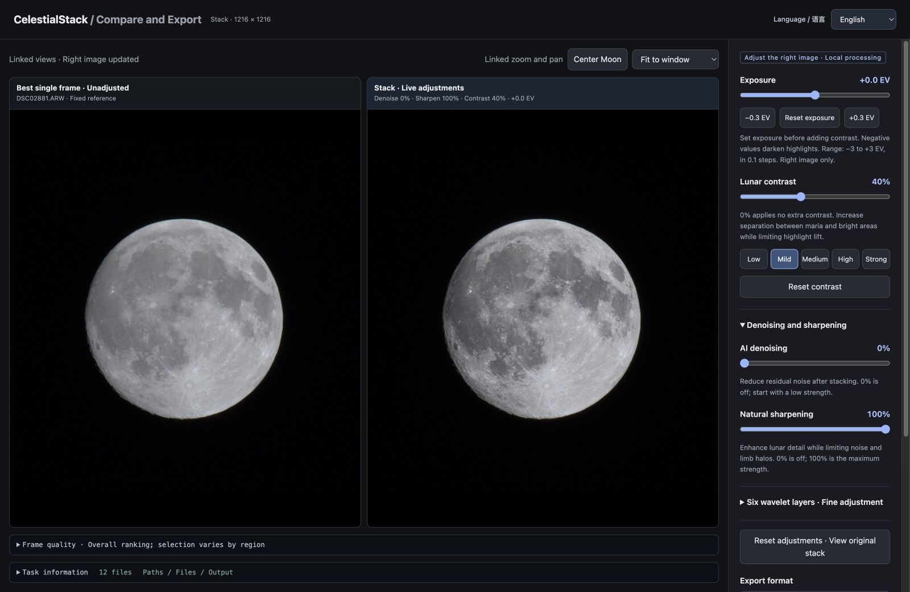

# CelestialStack

[简体中文](README.md) | English

CelestialStack is a lunar RAW stacking app with automatic frame selection and alignment, side-by-side comparison, and exposure, contrast, AI denoising and sharpening controls. Process photos locally and export 16-bit TIFF and maximum-quality JPG, with a Simplified Chinese or English interface.

**Version 0.3.5 public beta. This repository distributes installers and user documentation; the application source code is not public.**

**Currently supports Moon stacking only.** The welcome screen includes a **Celestial object** dropdown with **Moon** as its only option. Other celestial objects are not supported yet.

## Screenshot



CelestialStack 0.3.4 real-photo example (0.3.5 retains the same framing and image-processing features), freshly processed from 12 real RAW photos. Sky margins are another 25% wider than in 0.3.3, with crop dimensions rounded up. Both panels show the full composition at the same zoom: the unadjusted best single frame on the left and the adjusted stack on the right (denoise 0%, sharpen 100%, contrast 40%, exposure +0.0 EV). 

## Download and install

Open this repository's [Releases](https://github.com/sundeqi/CelestialStack/releases) page and download the macOS DMG from the public beta marked **Pre-release**. GitHub's automatically generated “Source code” archives contain this repository's documentation, not the application.

Open the DMG and drag the app into Applications. Launch it from Applications. See the [English user guide](docs/User_Guide.en.md) for installation and operation.

## Requirements and formats

| Item | Support |
|---|---|
| Computer | Apple Silicon Mac (M series) |
| System | macOS 15 or later; tested on macOS 15.8.1 |
| Input | At least 10 readable RAW photos from the same capture sequence |
| Formats | Sony ARW, Nikon NEF, Panasonic RW2, Canon CR2 / CR3 / CRW, Fujifilm RAF |
| Output | 16-bit TIFF and maximum-quality JPG, separately or together |

Real-photo testing has focused on Sony ARW. Other camera models and compression modes still need validation. A supported extension does not guarantee support for every camera configuration. This installer does not support Intel Macs, Windows or video input.

## Get started

1. Select **Moon** under **Celestial object**, then choose a RAW folder and scan it.
2. Enter the capture interval if known and choose an output location.
3. Keep the default settings, review the task, and start stacking.
4. Open the editor and compare matching areas at the same zoom level.
5. Adjust the right image and export TIFF, JPG or both.

## Interface language

Choose **English** or **简体中文** on the welcome screen or at the top right of either window. The first-launch default is English. Upgrades preserve your saved language preference. Your choice is saved and shared between windows without restarting the task or resetting image adjustments.

Raw diagnostic logs retain their original language. Some text in native file dialogs follows the macOS language setting. Folder paths and filenames are preserved exactly.

## Public beta notes

Photos are processed locally. Original RAW files are not overwritten. Keep your originals and important exports backed up.

The beta has not been signed with an Apple Developer ID or notarized. macOS may restrict its first launch. Verify the published checksum and follow [Apple's guidance for opening apps safely](https://support.apple.com/en-us/102445). Do not disable system-wide security protections.

Results depend on focus, movement, atmospheric conditions, exposure and the available frames. Stacking does not guarantee higher true resolution than the best single frame for every sequence. Strong adjustments can produce noise, halos or flattened texture.

## Support CelestialStack

If CelestialStack helped you create a lunar image you're happy with, consider leaving a voluntary tip to support continued development and maintenance. Thank you!

**USDT · TRON (TRC20)**

```text
TYuBQ5Rij9z7SddmyDyHz3ErzabeAUnnAT
```

[View QR code and network instructions](docs/SUPPORT.md)

[Support me on Bilibili](https://b23.tv/fRtpz7l) · Open the profile and choose “充电” (Support).

Tips are optional and do not affect access to the current public beta. They do not purchase a license for future paid versions or features.

## Other celestial objects and feedback

Currently, only Moon stacking is supported. If you would like stacking support for another celestial object, contact me via [Bilibili private messages](https://b23.tv/fRtpz7l) (open the profile and choose 私信) or [GitHub Issues](https://github.com/sundeqi/CelestialStack/issues/new/choose). Describe the target, equipment and capture sequence so I can assess future development.

Report reproducible issues through this repository's Issues page. Include the app version, Mac model, macOS version, camera model, RAW format and compression mode, frame count, steps and a short error message. Remove private usernames, paths and photo information from screenshots and logs before posting. You do not need to publish your original photos or entire task folder.

The public beta is distributed as proprietary software, not under an open-source license. Rights in the application and documentation are reserved; third-party components retain their respective licenses. See the [copyright notice](COPYRIGHT.md) and the notices included in the installer. Public beta availability does not promise that future versions will be free or continuously maintained.
